# AI Promotion Team Service

A **LangGraph**-powered multi-agent system for generating and sending personalized promotional emails. The workflow orchestrates multiple AI agents (Manager, Salespeople, Evaluator) to collaboratively create high-quality marketing emails.

## Architecture Overview

```mermaid
graph TD
    START((START)) --> Manager[🎯 Manager Strategy]
    Manager --> SalesPhase[📤 Start Sales Phase]

    subgraph Parallel["⚡ Parallel Execution"]
        SalesPhase --> SP1[✍️ Salesperson 1<br/>Rational Style]
        SalesPhase --> SP2[✍️ Salesperson 2<br/>Emotional Style]
    end

    SP1 --> Sync[🔄 Sync Drafts]
    SP2 --> Sync

    Sync --> Evaluator[📊 Evaluator]

    Evaluator -->|Approved| HTMLConv[🔧 HTML Converter]
    Evaluator -->|Needs Revision| SalesPhase

    HTMLConv --> ManagerReview[👔 Manager Review]
    Evaluator -->|Has HTML| ManagerReview

    ManagerReview -->|Approved| SendEmail[📧 Send Email]
    ManagerReview -->|Format Issues| HTMLFixer[🛠️ HTML Fixer]
    ManagerReview -->|Content Issues| SalesPhase
    HTMLFixer --> ManagerReview

    SendEmail --> END((END))
```



## Directory Structure

```
ai/
├── agents/              # AI Agent implementations
│   ├── base.agent.ts    # Abstract base class for all agents
│   ├── manager.agent.ts # Defines strategy & final approval
│   ├── salesperson.agent.ts # Writes email drafts
│   ├── evaluator.agent.ts   # Evaluates & selects best draft
│   └── types.ts         # Agent-related type definitions
├── graph/               # LangGraph workflow definition
│   ├── promotion-team.graph.ts # Main graph builder
│   ├── nodes.ts         # Node function implementations
│   └── types.ts         # State annotations & types
├── llm/                 # LLM configuration
│   └── index.ts         # LLM factory (OpenAI, etc.)
├── tools/               # Utility tools
│   ├── markdown.tool.ts # Markdown→HTML conversion
│   ├── email.tool.ts    # Email sending functionality
│   ├── file.tool.ts     # File operations
│   └── database.tool.ts # Product database queries
├── prompts/             # LLM prompt templates
├── data/                # Static data (products.json)
├── output/              # Generated files (gitignored)
└── index.ts             # Main entry point
```

## Workflow Phases

### 1. Manager Strategy (`managerStrategyNode`)

The manager analyzes the product and defines the promotion strategy:

- **Target audience** identification
- **Key selling points** extraction
- **Tone & call-to-action** definition

### 2. Parallel Drafting (`salesperson1Node`, `salesperson2Node`)

Two salespeople write emails **in parallel** with different styles:

| Salesperson   | Style         | Approach                                  |
| ------------- | ------------- | ----------------------------------------- |
| Salesperson 1 | **Rational**  | Facts, features, value proposition        |
| Salesperson 2 | **Emotional** | Storytelling, lifestyle, brand connection |

### 3. Evaluation (`evaluatorNode`)

The evaluator:

- Scores each draft independently
- Provides targeted feedback per salesperson
- Selects the best draft when approved
- Generates HTML when all drafts pass

### 4. Manager Review (`managerReviewNode`)

Final approval gate:

- Reviews HTML content for accuracy
- Checks product information (prices, discounts)
- Verifies similar product recommendations
- Routes to appropriate fix path if issues found

### 5. Send Email (`sendEmailNode`)

Delivers the approved email:

- Saves final HTML to output folder
- Sends to all customer emails
- Records send statistics

## State Management

The workflow uses **LangGraph Annotations** for state management:

```typescript
const PromotionTeamAnnotation = Annotation.Root({
  // Input data
  product: Annotation<ProductInfo>,
  customerEmails: Annotation<string[]>,
  similarProducts: Annotation<ProductInfo[]>,

  // Strategy & drafts
  strategy: Annotation<PromotionStrategy>,
  emailDrafts: Annotation<EmailDraft[]>,  // Reducer: append

  // Evaluation
  evaluationResult: Annotation<EvaluationResult>,
  htmlContent: Annotation<string>,
  managerReview: Annotation<ManagerReviewResult>,

  // Workflow control
  iterationCount: Annotation<number>,      // Reducer: add
  needsRevision: Annotation<{...}>,        // Selective regeneration
})
```

## Key Features

### Selective Regeneration

When revisions are needed, only the failing salesperson regenerates:

```typescript
needsRevision: {
  salesperson1: boolean,  // Only regenerate if true
  salesperson2: boolean,  // Only regenerate if true
}
```

### Feedback Loops

Three types of revision paths:

1. **Evaluator → Salespeople**: Draft quality issues
2. **Manager → HTML Fixer**: Format-only issues
3. **Manager → Salespeople**: Content accuracy issues

### Iteration Limits

Prevents infinite loops with `MAX_ITERATIONS = 10`. If reached:

- Workflow proceeds with best available draft
- Manager rejection at max iterations triggers abort (prevents sending incorrect content)

## Usage

```typescript
import { runPromotionTeam } from './services/ai'

const result = await runPromotionTeam({
  product: {
    id: 'APE-tshirt-2',
    name: 'Premium Cotton Tee',
    price: 29.99,
    originalPrice: 49.99,
    // ... other fields
  },
  customerEmails: ['customer@example.com'],
  similarProducts: [
    /* related products for recommendations */
  ],
})

console.log(result.success) // true/false
console.log(result.htmlContent) // Final HTML email
console.log(result.sentCount) // Emails sent
console.log(result.iterations) // Revision cycles used
```

## Output Files

Each workflow run creates a timestamped folder in `output/`:

```
output/
└── Premium_Cotton_Tee_2024-01-15T10-30-00/
    ├── draft_salesperson-rational_rational.md
    ├── draft_salesperson-emotional_emotional.md
    ├── email_draft_v1.html
    ├── email_draft_v2.html  (if revisions occurred)
    └── final_email.html
```

## LLM Configuration

Configure the LLM provider in `llm/index.ts`:

```typescript
const llm = createLLM({
  provider: 'openai',
  model: 'gpt-4-mini',
  timeout: 1800000, // 30 minutes
})
```

Supported providers: `openai`, `anthropic`, `azure`
